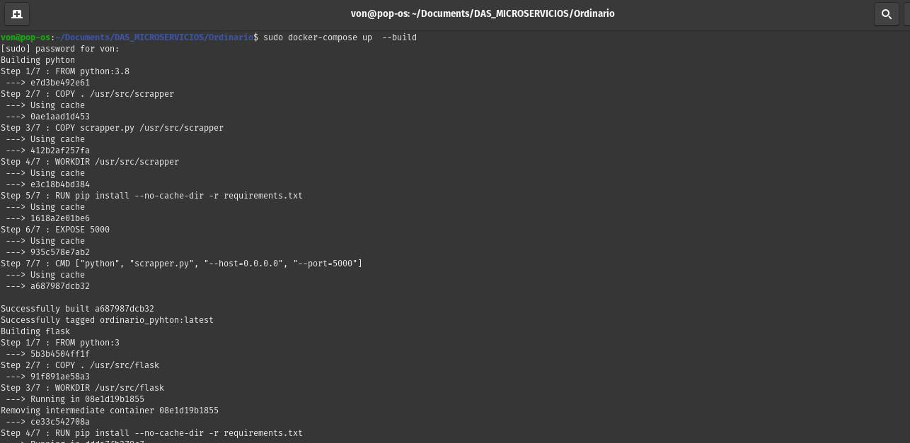
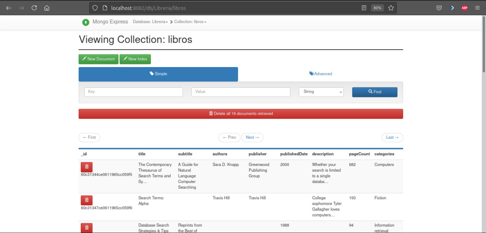
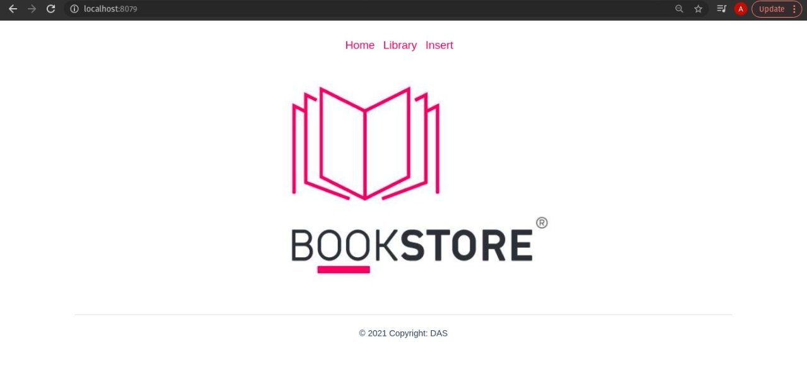
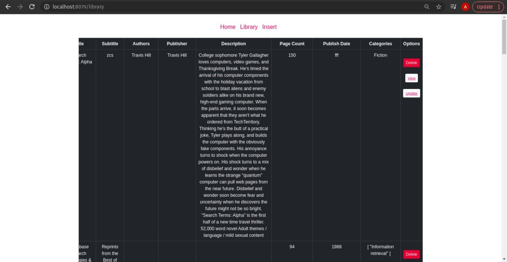
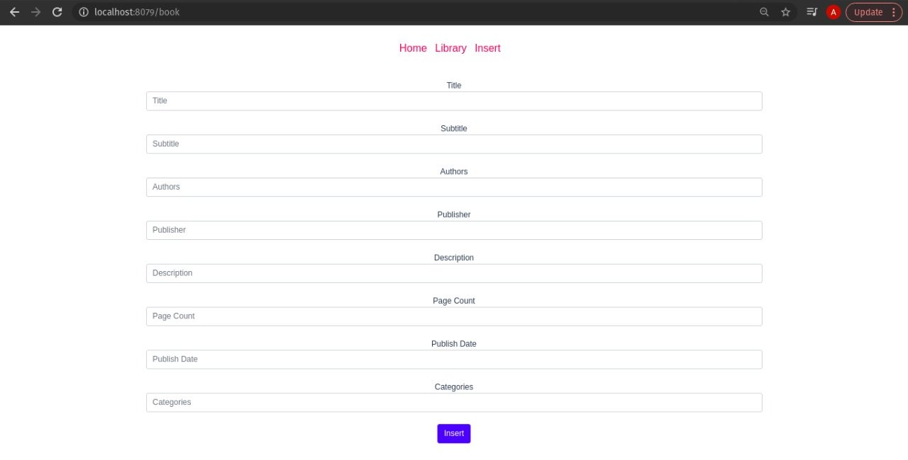
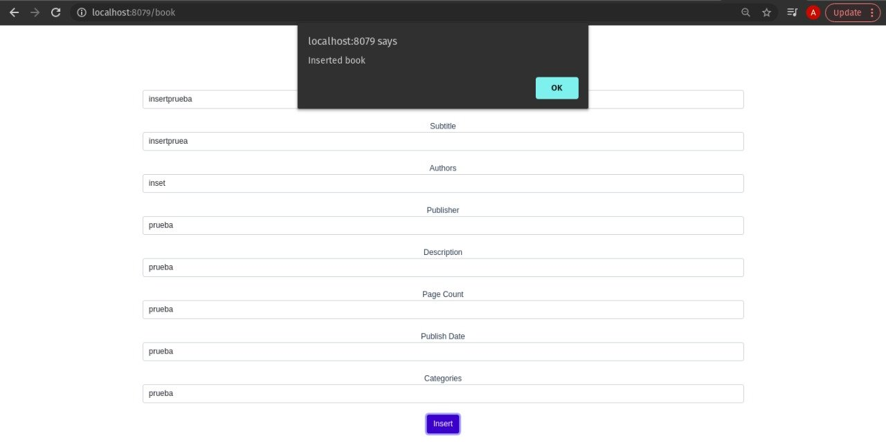
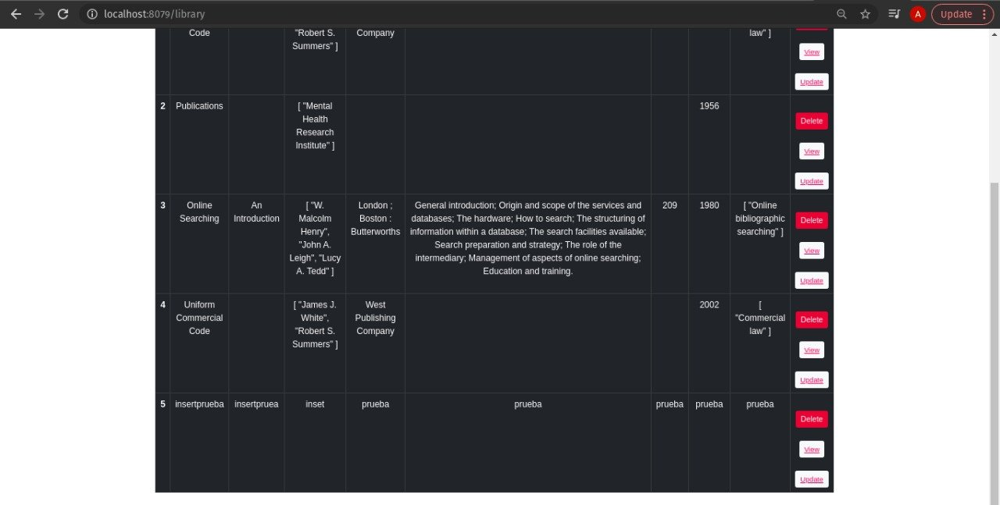
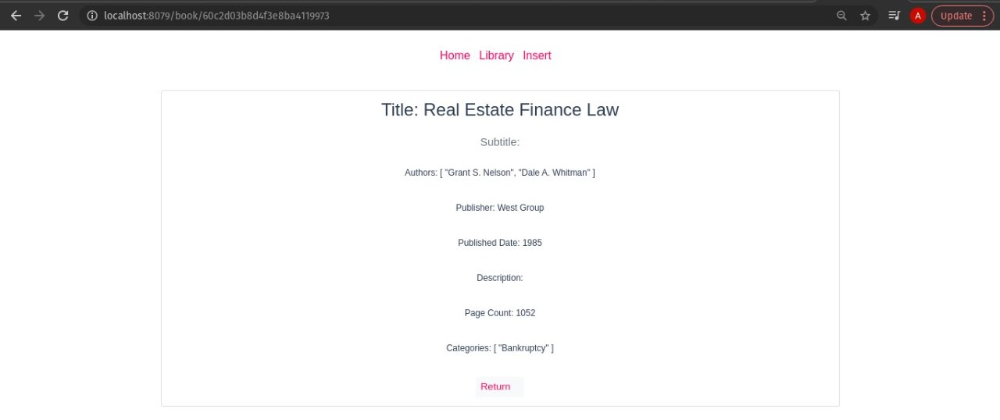
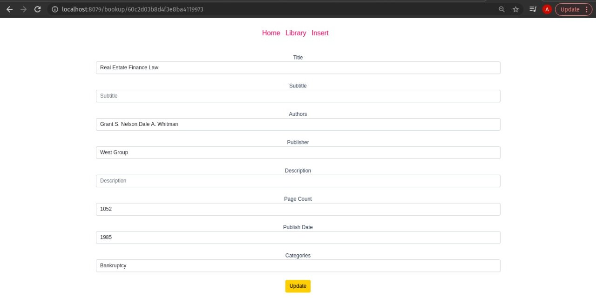
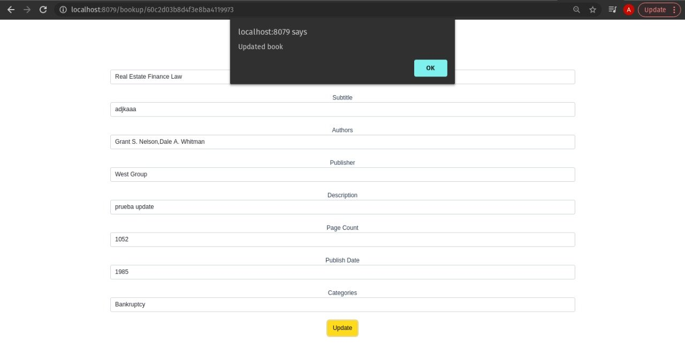

# [DAS_MICROSERVICIOS](https://github.com/alicia-granados/DAS_MICROSERVICIOS)
Repository for the final project of the subject Software Design and Architecture implementing the Microservices Architecture.

## Subject.
Diseño y Arquitectura de Software.

## Professor.
Angel Santiago Jaime Zavala.

## Team.
- Alicia Montserrat Monjaras Granados
- Jorge de Jesús Hernández Vázquez
- Bryan Peña Balderas

## Prerequisites.
- Docker
- DockerCompose

## Diagram Architecture.

## Tecnologíes.
This are the main technologies that we use to develop this project:
- Mongo (Database)
- MongoExpress (DBMS)
- Vue.js (Frontend)
- Flask (Backend)
- Rabbit (Broker)

To orchestrate containers we use:
- Docker
- DockerCompose

### Architecture.
The established architecture was "microservices" with a total of 6 services distributed in different containers.
- ***Container A***: Contains a functional image of **MongoDB**.  
His name is *"mongo_db"*
- ***Container B***: Contains a functional image of **MongoExpress**.  
His name is *"dbms"*
- ***Container C***: Contains an scrapper made in **Python**, that extracts data from 
[Vocadb](https://developers.google.com/books), and inserts it into the database.  
His name is *"scraperLibros"*
- ***Container D***: Contains an image of **Flask**, which will be used as an API to establish communication and handling of requests.
His name is  *"pyapp"*
- ***Container E***: Contains a functional image of **RabbitMQ**.
His name is  *"rabbit"*
- ***Container F***: Contains a functional image of **Vue.js**, which shows the graphical interface of a website, where you can make different requests to the api.
His name is  *"vue"*

## Instructions for running the containers.
1. Clone the repository.
2. Enter the repository folder.
3. In case of having containers running, make sure that all containers are stopped.
<code>$ sudo docker stop $(sudo docker ps -q -a)</code>
4.- Make sure all the ports needed to run the containers are available.
5.- As an optional step you can delete all the images and containers so that they do not cause any  type of conflict .
<code>$ docker system prune --all</code>
6.- Run the orchestrator.
<code>$ sudo docker-compose up --build</code>
> Help: Once it is running we can see what is happening on the console.

## Instructions to access the services
1.- MongoDB service runs on the port *27017*.
2.- The MongoExpress web service runs on http://localhost:8082.
<code>user: foo</code>  
<code>password: bar123</code>
3.- The Python service (API) runs on http://localhost:5000.
3.- The Flask service runs on http://localhost:5001.
4.- RabbitMQ service runs on port *15672*  also runs in http://localhost:15672.
5.- The Vue.js service runs on http://localhost:8079

## Mongo Express Tour
This service allows the storage, modification and extraction of information in a database. First, you need to enter the credentials to access the database.

It will show the books inserted from Container C. There you can insert, delete, update or view the information of the book through the Mongo dbms.

## Tour of the Vue.js website
This service is based on consuming the Flask container API through HTTP methods.

By clicking on the Library link, you will find a table with all the books in the database.

You can also register your own books, by default the form already has information
basis for a faster demonstration.

To check that your book has been registered successfully, you just have to go back to the Bookstore category and see
the last book that was inserted.

We also have the options to delete, view and update.

To delete it is only necessary to click on the delete button. After doing the previous step, the alert will be displayed with the message that the book was deleted.
  

To see the information of only one book it is necessary to click on the View button.

To update the information of a book it is necessary to click on Update. After doing the previous step, a form with the information of the book will be displayed, and if it is necessary to update, just enter that information in the corresponding field and then go to click on the update button, then the alert will be displayed with the message that the book was updated.

## Additional features
In the folder <code>vue</code> you will find another README with technical details of Vue.js.

## Project Video
[DAS_MICROSERVICIOS](https://drive.google.com/file/d/1uMHLMG_LsaQVn6itzyvkREYkrWXNFvk0/view?usp=sharing)